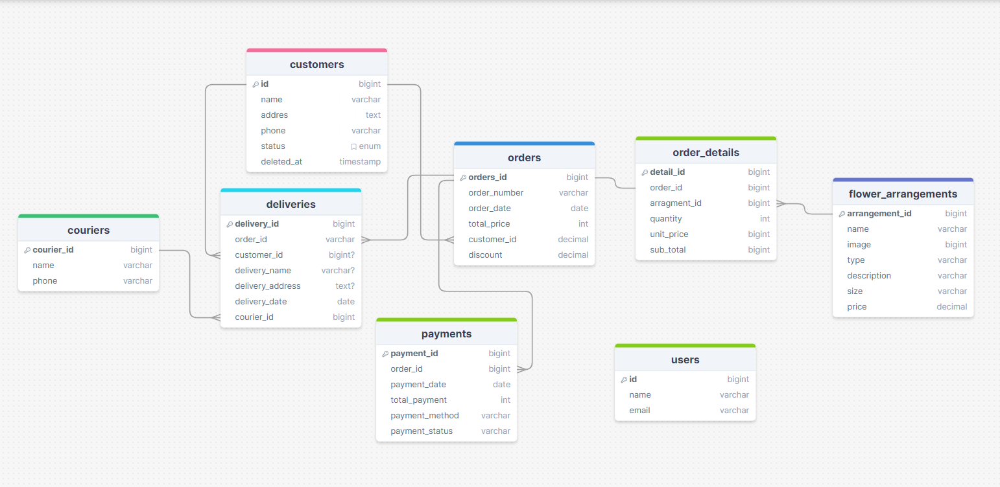

# Laravel Tugas1 SBD Filament: CRUD & Admin Panel Implementation

## Table of Contents

- [Laravel Tugas1 SBD Filament: CRUD \& Admin Panel Implementation](#laravel-tugas1-sbd-filament-crud--admin-panel-implementation)
  - [Table of Contents](#table-of-contents)
  - [Description](#description)
  - [Features](#features)
  - [Database Schema](#database-schema)
  - [About Laravel](#about-laravel)
  - [Installation](#installation)
  - [Filament Admin Template](#filament-admin-template)
  - [Usage](#usage)
  - [Case Example](#case-example)
  - [Contact](#contact)
  - [Contribution](#contribution)
  - [License](#license)
  
## Description

Proyek ini adalah implementasi dari tugas pertama Sistem Basis Data (SBD) menggunakan Laravel. This project implements CRUD operations and an admin panel using the Laravel framework and the Filament admin template. For more details about the case study, please refer to [case example](contohkasus.md).

## Features

- CRUD (Create, Read, Update, Delete) operations for the main entity.
- User input validation.
- Middleware for user authentication.
- Admin panel using Filament template.
- Database seeder for initial admin user.

## Database Schema

The database schema for this project is visualized in the following diagram:

For a detailed view and interaction with the schema, please refer to the [DrawSQL diagram](https://drawsql.app/teams/dreamer-3/diagrams/tugas-sbd2).

## About Laravel

Laravel is a PHP framework that is elegant and expressive, designed to make web development a joyful and creative experience for developers. For more information about Laravel, visit [About Laravel](laravel.md).

## Installation

1. **Clone this repository to your local machine.**

    ```bash
    git clone https://github.com/IlhamGhaza/laravel-tugas1sbd-filament.git
    ```

2. **Navigate to the project directory.**

    ```bash
    cd laravel-tugas1sbd-filament
    ```

3. **Install dependencies using Composer.**

    ```bash
    composer install
    ```

4. **Copy the `.env.example` file to `.env`.**

    ```bash
    cp .env.example .env
    ```

5. **Generate the application key.**

    ```bash
    php artisan key:generate
    ```

6. **Configure your database in the `.env` file.**

7. **Run migrations to create the database tables.**

    ```bash
    php artisan migrate
    ```

8. **Run the application.**

    ```bash
    php artisan serve
    ```

9. **Visit the admin panel at**

   ```bash
    http://127.0.0.1:8000/admin
    ```

10. **Use the following credentials to log in:**
    - Email: `ilham@admin.com`
    - Password: 12345678

**Note:** You can edit in database seeder

  ```bash
  database\seeders\DatabaseSeeder.php
  ```

  **If Composer troubles run this command:**
  
  ```bash
    composer update
    composer dump-autoload
   ```

## Filament Admin Template

This project utilizes the Filament admin template for creating an intuitive and user-friendly admin panel. Filament is a powerful tool for quickly generating administrative interfaces. For more information about Filament, visit the [Filament documentation](https://filamentphp.com/docs).

To install Filament, follow these steps:

1. **Install Filament using Composer:**

    ```bash
    composer require filament/filament="3.2.57" -W
    ```

2. **Publish the Filament configuration:**

    ```bash
    php artisan vendor:publish --tag=filament-config
    ```

3. **Configure Filament by editing the `config/filament.php` file as needed.**

4. **Create Filament resources and pages using Artisan commands. For instance, to generate resources like a Post resource (assuming Post is your model):**

    ```bash
     php artisan make:filament-resource Post
    ```

   **For beginners looking for a step-by-step guide, check out this [tutorial video for beginners](https://youtube.com/playlist?list=PLqDySLfPKRn6fgrrdg4_SmsSxWzVlUQJo&si=GhXQaFVjgIB1pSbu).**

## Usage

To use this project, follow the installation steps provided above. Once the application is running, you can access the admin panel at `http://127.0.0.1:8000/admin` using the credentials mentioned earlier.

## Case Example

For a detailed example of how to use this project, please refer to the [case example](contohkasus.md).

## Contact

For any questions or issues, please open an issue on this repository or contact the project maintainer directly.

## Contribution

If you wish to contribute to this project, please fork this repository and submit a pull request with your changes.

## License

This project is licensed under the MIT License. You may not use this project for commercial purposes. See the [LICENSE](LICENSE) file for more details.
